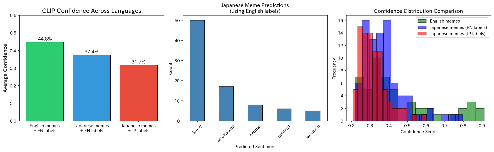

# cross-lingual-clip-memes

# Cross-Lingual Meme Understanding with CLIP

**Research Question:** Does CLIP's multimodal understanding transfer cross-lingually to Japanese memes?

## Key Results

| Dataset | Avg Confidence |
|---------|----------------|
| English memes + English labels (n=50) | **44.8%** |
| Japanese memes + English labels (n=86) | **37.4%** |
| Japanese memes + Japanese labels (n=86) | **31.7%** |

### Key Findings

1. **Cross-lingual gap: 7.4%** — CLIP shows lower confidence on Japanese memes compared to English memes
2. **Label language gap: 5.7%** — Japanese labels perform worse than English labels on Japanese images
3. **Accuracy on Japanese memes: 41.9%** — When comparing CLIP predictions to human annotations
4. **Sentiment bias:** CLIP predicted "funny" for 58% of Japanese memes, while completely missing sarcasm (0% accuracy)

### Visualizations



## Methodology

### Datasets
- **English Memes:** 50 memes from [Hateful Memes dataset](https://huggingface.co/datasets/limjiayi/hateful_memes_expanded)
- **Japanese Memes:** 86 manually collected and annotated memes from Japanese social media

### Model
- OpenAI CLIP (ViT-B/32)
- Zero-shot classification with sentiment labels

### Evaluation Protocol
1. Zero-shot sentiment classification (6 labels)
2. Cross-lingual comparison (same images, different label languages)
3. Accuracy analysis against human annotations

## Repository Structure
```
cross-lingual-clip-memes/
├── CrossLingual_CLIP_Meme_Understanding.ipynb  # Main experiment notebook
├── README.md
├── figures/
│   ├── cross_lingual_comparison.png    # Main results figure
│   └── english_baseline_results.png    # English baseline
├── results/
│   ├── summary_statistics.json         # All statistics
│   ├── english_meme_results.csv        # English meme predictions
│   └── japanese_meme_results.csv       # Japanese meme predictions
├── data/
│   ├── japanese_memes/                 # Japanese meme images (86 files)
│   └── japanese_memes_annotations.csv  # Annotations with translations
└── requirements.txt
```

## Quick Start

### Run in Google Colab
[](https://colab.research.google.com/github/maliha-usui/cross-lingual-clip-memes/blob/main/CrossLingual_CLIP_Meme_Understanding.ipynb)

### Local Setup
```bash
git clone https://github.com/maliha-usui/cross-lingual-clip-memes.git
cd cross-lingual-clip-memes
pip install -r requirements.txt
```

## Japanese Meme Categories

| Category | Count | Examples |
|----------|-------|----------|
| Anime (JJK, Demon Slayer, Spy×Family) | 15+ | Character memes, scene edits |
| Gaming (Pokemon, FF14, Touhou) | 10+ | Game references, crossovers |
| Bokete-style | 8+ | Image + caption humor |
| TV/Variety shows | 5+ | Celebrity reactions |
| VTuber | 4+ | Hololive, Nijisanji |
| Political satire | 4+ | Current events |
| Cat memes | 4+ | 猫ミーム |
| AI-generated | 4+ | ChatGPT/AI art humor |

## Citation

If you use this work, please cite:
```bibtex
@misc{mamun2025crosslingual,
  author = {Mamun, Maliha Binte},
  title = {Cross-Lingual Meme Understanding with CLIP: Evaluating Vision-Language Models on Japanese Content},
  year = {2025},
  publisher = {GitHub},
  url = {https://github.com/maliha-usui/cross-lingual-clip-memes}
}
```

## 🔗 Related Work

- [OpenAI CLIP](https://github.com/openai/CLIP)
- [Multilingual CLIP](https://github.com/FreddeFrallan/Multilingual-CLIP)
- [Hateful Memes Challenge](https://ai.facebook.com/tools/hatefulmemes/)

## Author

**Maliha Binte Mamun**
- PhD in Informatics, Shizuoka University (2024)
- Research: NLP, Multimodal AI, Cross-cultural Understanding

## License

MIT License - See [LICENSE](LICENSE) for details.

---

*This project was created as part of research into cross-lingual multimodal understanding, with applications to Japanese entertainment content analysis.*
